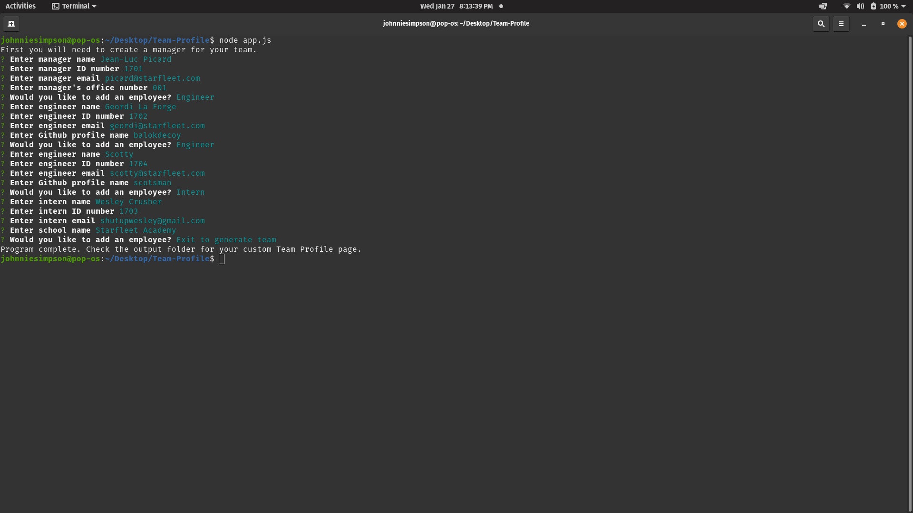
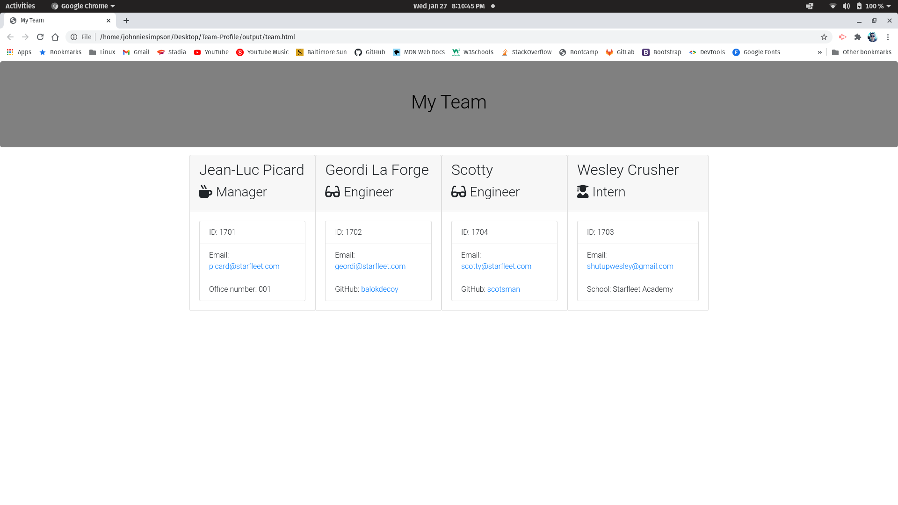

# Team Profile Generator

  [](https://www.gnu.org/licenses/gpl-3.0)

  ## Table of Contents

  - [Description](#description)

  - [Installation](#installation)

  - [Usage](#usage)

  - [Contributing](#contributing)

  - [Tests](#tests)

  - [Questions](#questions)

  - [Licenses](#licenses)

  ## Description

  A CLI program that creates a custom software development team profile page for web deployment. 

  ## Screenshots





  ## Installation

  ```bash
  npm i 
  ```
  ```bash
  npm install --save-dev jest
  ```
  ## Usage

  Open a terminal session and navigate to the Team Profile directory. Enter 'node app.js' in the terminal to begin the program. The program will ask you to create a Manager profile. Enter manager details based on the prompts. Once a manager is created, you will be asked if you would like to add an Engineer, add an Intern, or exit the program to create the Team Profile html file. Once you have added as many Engineer and Intern profiles as you like, select Exit to generate team. A file called 'team.html' will appear in the ouptut/ directory. This file can be viewed in the browser as a completed Team Profile webpage. 

[View a program tutorial](https://www.youtube.com/watch?v=p5fg0kJxQMQ&feature=youtu.be)

[](https://www.youtube.com/watch?v=p5fg0kJxQMQ&feature=youtu.be)

  ## Contributing

  This project is free and open source software. Please reach out to me directly if you'd like to contribute. See the Questions section for contact info.

  ## Tests

  ```bash
  npm test
  ```
  ## Questions

  Visit my Github profile at http://www.github.com/balokdecoy.

  If you have questions, you can reach me via email at johnniesimpson88@gmail.com.

  ## Licenses
 Licensed under [GPL v3](https://www.gnu.org/licenses/gpl-3.0)
